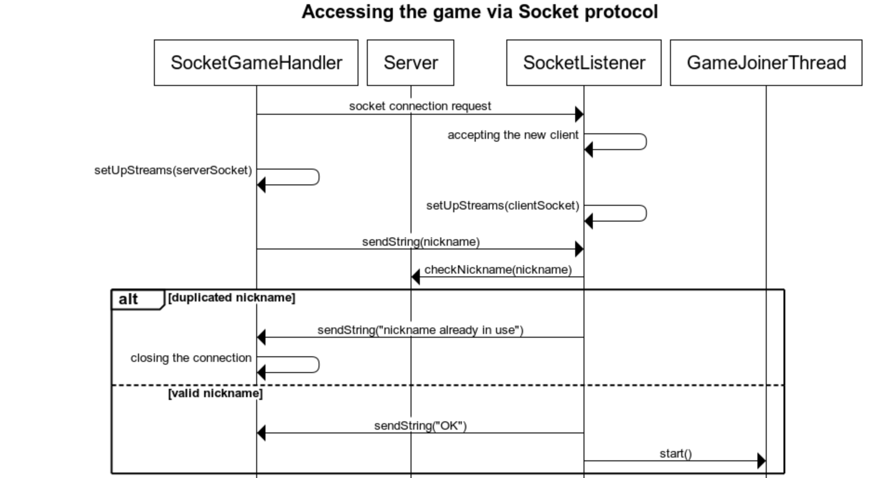
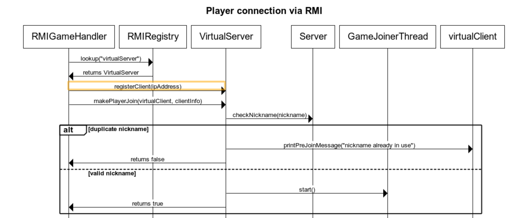

# Sequence diagrams

## Access to the game galaxy trucker by a player through socket protocol

The 'SocketGameHandler' class is istanciated and used directly by the 'Client' class. The 'setUpStreams' method is used on both side to set up the input and output streams, without which communication would not be possible. 

'closing the connection' means that the connection resources are closed and the client execution is terminated. If the nickname is not repeated, the lobby is started , handled by the GameJoinerThread, and the client continues its execution. 

## Access to the game galaxy trucker by a player through rmi protocol

The 'RMIGameHandler' class is istanciated and used directly by the 'Client' class.

The 'makePlayerJoin' method returns false if the nickname of the client is already in use, true otherwise. False is returned immediately after the control and immediately ends the client execution, while true is returned after the client has joined a game, i.e, after the lobby phase is ended.  
