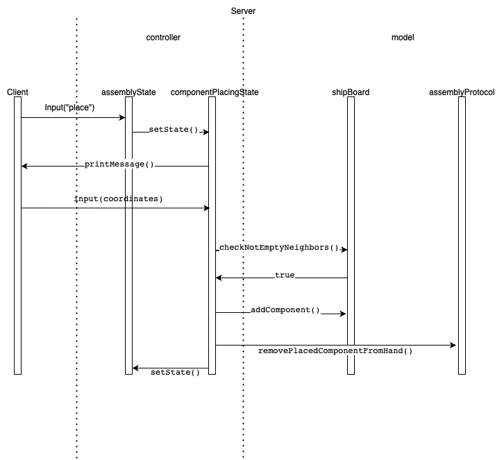
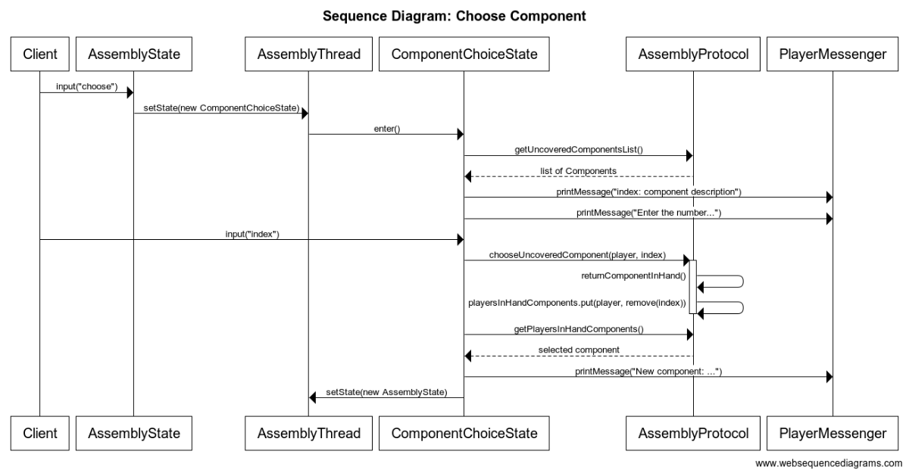

# Sequence diagrams

## Access to the game galaxy trucker by a player through socket protocol

The 'SocketGameHandler' class is istanciated and used directly by the 'Client' class. The 'setUpStreams' method is used on both side to set up the input and output streams, without which communication would not be possible. 

'closing the connection' means that the connection resources are closed and the client execution is terminated. If the nickname is not repeated, the lobby is started , handled by the GameJoinerThread, and the client continues its execution. 

## Access to the game galaxy trucker by a player through rmi protocol

The 'RMIGameHandler' class is istanciated and used directly by the 'Client' class.

The 'makePlayerJoin' method returns false if the nickname of the client is already in use, true otherwise. False is returned immediately after the control and immediately ends the client execution, while true is returned after the client has joined a game, i.e, after the lobby phase is ended.  

## Component placing on the shipboard

We have implemented the game-state pattern in the assembly phase. From the starting state of assemblyState we analise the inputs of the client and we move to the various states.

The componentPlacingStates asks for the coordinates where the client wants to put his component. It handles user's input performing several checks to validate the provided coordinates and then calls the appropriate methods on the shipboard to update it.

## Choose component from the uncovered list

"Choose" updates the state to componentPlacingState. The server provides the list of available components in the uncoveredComponents list of the assemblyProtocol and after controlling the validity of the input puts the chosen in player's hand.
